# PidgeonGuard

PidgeonGuard is a custom embedded system designed around an STM32 microcontroller and a dedicated PCB. The project combines sensor acquisition, actuator control, local data logging, power management, and low-power operation in a standalone embedded device.

The project was developed as a complete hardware–firmware system, including early prototyping on a development board, schematic and PCB design, assembly, firmware development, peripheral integration, mechanical design, 3D printing, debugging, and hardware testing.

<p align="center">
  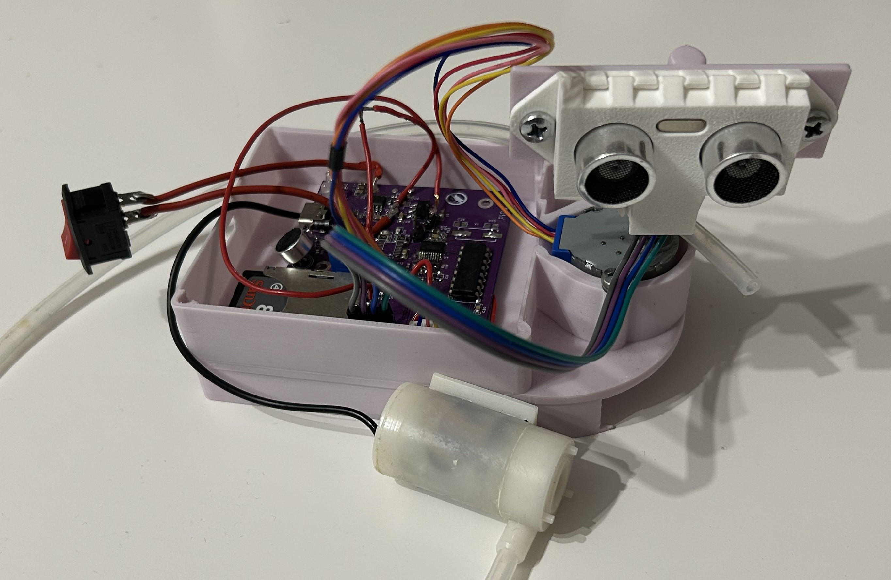
</p>

---

## Project Overview

The main goal of the project was to design and build a compact autonomous embedded device capable of detecting activity in its surroundings, performing distance measurements, controlling mechanical actuators, storing measurement data, and entering a low-power mode when inactive.

The device is intended for use on balconies or in other areas where birds may cause cleanliness issues. When an animal is detected, the system wakes up and determines the bird’s approximate location. Since repeated exposure to the same movement or sound may cause the bird to become accustomed to the deterrent, the device uses an additional response. After locating the target, a water pump is activated to spray water in its direction, providing a more effective and less predictable deterrent.

The development process was divided into two main stages.

The first working prototype was developed using an **STM32G4 Nucleo development board** together with ready-made peripheral modules. This version was used to verify the overall concept and develop the first working firmware before committing to a custom PCB.

The prototype included, among others:

* an external stepper motor driver module,
* a microSD card module,
* a ready-made microphone/sound detection module used for wake-up,
* an ultrasonic distance sensor,
* a stepper motor,
* a water pump control circuit.

Once the main system functionality had been validated, the project was migrated to a dedicated PCB.

For the final custom board, the **STM32G030F6P6** was selected. Compared with the STM32G4 used during prototyping, it is a significantly smaller and less powerful microcontroller, but its resources are sufficient for the target application.

Main functionalities include:

* ultrasonic distance measurement,
* stepper motor control,
* water pump control,
* sound/activity detection,
* microSD card data logging,
* RTC-based timekeeping,
* low-power standby operation,
* external wake-up handling,
* peripheral power switching,
* UART communication and diagnostics.

---

# Prototype Stage

At this stage, the main objective was to validate individual subsystems and verify that they could operate together before designing dedicated hardware.

Ready-made modules were intentionally used to shorten the first development cycle and simplify debugging.

### Block Diagram

<p align="center">
  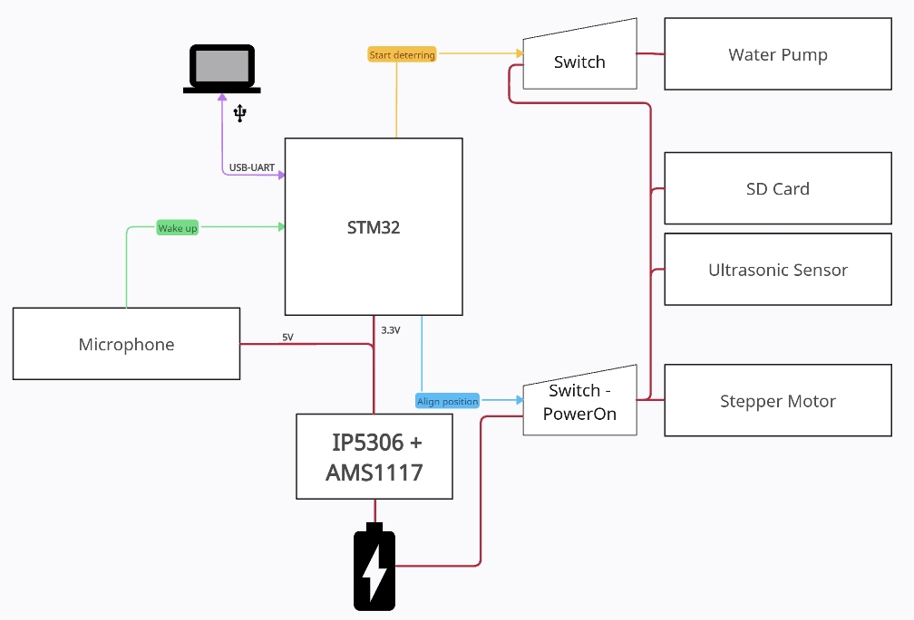
</p>

---

## Sensors

### Ultrasonic Distance Measurement

Distance measurements are performed using an **HC-SR04 ultrasonic sensor**.

The STM32 generates the TRIGGER pulse and measures the ECHO pulse width using a **hardware timer** configured in **input capture mode**.

The firmware uses timer-based pulse measurements rather than software polling, allowing more precise distance acquisition.

The measured echo pulse duration is converted into distance.

### Sensor testing

<p align="center">
  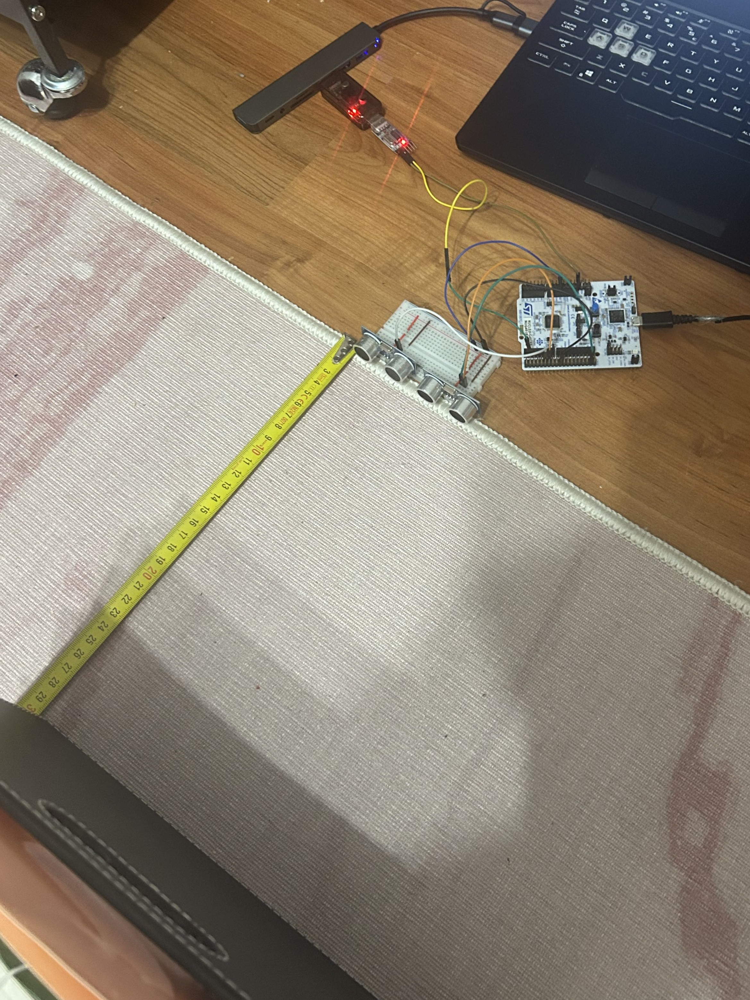
</p>

### Sensor response

<p align="center">
  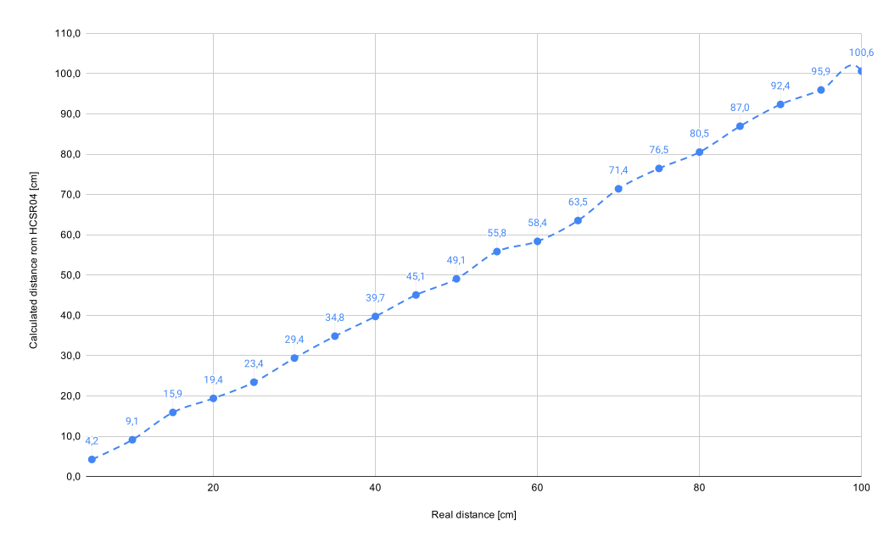
</p>

---

### Sound Detection

The first prototype used a ready-made sound detection module based on an **LM393 comparator**.

This module was connected to the STM32G4 Nucleo and was used to validate the concept of waking the system after detecting external sound/activity.

For the custom PCB, the ready-made module was replaced by an integrated sound detection circuit.

The custom version is based on:

* an electret microphone,
* LMV331 comparator,
* adjustable detection threshold,
* STM32 wake-up input.

The detector is intended to allow the STM32 to remain in a low-power state until external activity is detected.

---

### Stepper Motor

Mechanical positioning is performed using a **28BYJ-48 stepper motor**.

During the initial STM32G4 prototype stage, the motor was controlled using a ready-made ULN2003 driver board.

In the custom hardware version, the motor driver interface was incorporated into the project electronics, reducing reliance on external development modules.

The motor can rotate in both directions and is used to scan the surrounding area.

Example control functions include:

```c
void controlSMotor(int32_t stepNumber, uint8_t direction);
void calibrateDistance(void);
void lookForTarget(void);
```

Four STM32 GPIO outputs drive the motor phases.

The firmware uses the following four-step sequence:

```c
if (direction == 0)
{
    while (stepNumber > stepsPerformed)
    {
        switch (stepsPerformed % 4)
        {
            case 0:  // 1010
                HAL_GPIO_WritePin(SMOTOR124_PORT, SMOTOR_INI1_PIN, GPIO_PIN_SET);
                HAL_GPIO_WritePin(SMOTOR124_PORT, SMOTOR_INI2_PIN, GPIO_PIN_RESET);
                HAL_GPIO_WritePin(SMOTOR3_PORT, SMOTOR_INI3_PIN, GPIO_PIN_SET);
                HAL_GPIO_WritePin(SMOTOR124_PORT, SMOTOR_INI4_PIN, GPIO_PIN_RESET);
                break;

            case 1:  // 0110
                HAL_GPIO_WritePin(SMOTOR124_PORT, SMOTOR_INI1_PIN, GPIO_PIN_RESET);
                HAL_GPIO_WritePin(SMOTOR124_PORT, SMOTOR_INI2_PIN, GPIO_PIN_SET);
                HAL_GPIO_WritePin(SMOTOR3_PORT, SMOTOR_INI3_PIN, GPIO_PIN_SET);
                HAL_GPIO_WritePin(SMOTOR124_PORT, SMOTOR_INI4_PIN, GPIO_PIN_RESET);
                break;

            case 2:  // 0101
                HAL_GPIO_WritePin(SMOTOR124_PORT, SMOTOR_INI1_PIN, GPIO_PIN_RESET);
                HAL_GPIO_WritePin(SMOTOR124_PORT, SMOTOR_INI2_PIN, GPIO_PIN_SET);
                HAL_GPIO_WritePin(SMOTOR3_PORT, SMOTOR_INI3_PIN, GPIO_PIN_RESET);
                HAL_GPIO_WritePin(SMOTOR124_PORT, SMOTOR_INI4_PIN, GPIO_PIN_SET);
                break;

            case 3:  // 1001
                HAL_GPIO_WritePin(SMOTOR124_PORT, SMOTOR_INI1_PIN, GPIO_PIN_SET);
                HAL_GPIO_WritePin(SMOTOR124_PORT, SMOTOR_INI2_PIN, GPIO_PIN_RESET);
                HAL_GPIO_WritePin(SMOTOR3_PORT, SMOTOR_INI3_PIN, GPIO_PIN_RESET);
                HAL_GPIO_WritePin(SMOTOR124_PORT, SMOTOR_INI4_PIN, GPIO_PIN_SET);
                break;
        }
    }
}
```

---

### Pump Control

The system also includes control of a small water pump.

The pump is controlled by the STM32 through an integrated switching stage and is activated by firmware when the appropriate system condition is detected.

Example firmware function:

```c
sprayWater();
```

---

### microSD Data Logging

Measurement and diagnostic data can be stored on a microSD card.

The SD card communicates with the STM32 through **SPI1** and is accessed using the **FatFS filesystem**.

In the first STM32G4 prototype, SD card functionality was tested using a ready-made SD card module.

The custom PCB later replaced this module with a dedicated microSD card interface integrated directly into the board.

The firmware is capable of:

* mounting the filesystem,
* creating and opening files,
* writing logs,
* storing measurement results,
* preserving diagnostic information between operating cycles.

Example high-level logging function:

```c
logToSD();
```

FatFS was configured to reduce memory usage and fit within the limited resources of the **STM32G030F6P6**:

```c
#define _FS_READONLY    0
#define _FS_MINIMIZE    0
#define _USE_FIND       0
#define _CODE_PAGE      1
#define _USE_LFN        0
#define _FS_RPATH       0
```

---

### Real-Time Clock

The STM32 RTC is used to maintain time information for system operation and logging.

The RTC is configured using the internal low-speed oscillator.

Backup registers are used to determine whether the RTC has already been initialized. This prevents the firmware from resetting the stored date and time after every MCU reset.

---

## Logs

Logs stored on the SD card can be used to identify important events during device operation, including:

* system wake-up,
* entering low-power mode,
* successful calibration,
* object detection,
* actuator activation,

Example log format:

### LOGS.txt

```text
WKUP: 08-04-2026 21:52:55
WKUP: 08-04-2026 21:53:50
WKUP: 08-04-2026 21:54:44
WKUP: 08-04-2026 21:55:39
WKUP: 08-04-2026 21:56:33
WKUP: 08-04-2026 21:57:27
WKUP: 08-04-2026 21:58:22
WKUP: 08-04-2026 21:59:16
WKUP: 08-04-2026 22:00:11
WKUP: 08-08-2026 22:01:05
WKUP: 08-08-2026 22:05:51
WKUP: 08-08-2026 23:49:20
SHOOT: 08-08-2026 23:49:34
WKUP: 08-08-2026 23:54:21
SHOOT: 08-08-2026 23:54:36
SHOOT: 08-08-2026 23:54:38
WKUP: 08-08-2026 23:55:18
WKUP: 08-08-2026 23:56:12
WKUP: 08-08-2026 23:57:07
WKUP: 08-08-2026 23:58:01
SHOOT: 08-08-2026 23:58:46
```

---

## Power Supply

The device was designed to operate from a battery-powered supply.

During development, different power supply approaches were tested. One of the initial concepts used an **IP5306 power-bank controller**, but low-current operation introduced problems with automatic output shutdown.

The final prototype was therefore tested using an **18650 Li-Ion battery** with a linear 3.3 V regulator powering the STM32.

Some peripherals operate from a separate 5 V domain.

Peripheral power can be switched by the MCU to reduce power consumption when the system enters low-power operation.

### Power Consumption Measurements

Power consumption was measured during development to verify the behavior of the power supply and low-power modes.

The measurements shown below were taken while the device was operating in scanning mode.

These measurements should be treated as approximate because short high-current peaks, such as those occurring during SD card writes, may not be fully captured by the measurement equipment.

<p align="center">
  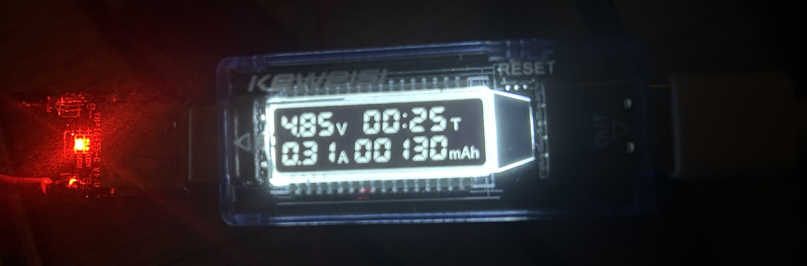
</p>

<p align="center">
  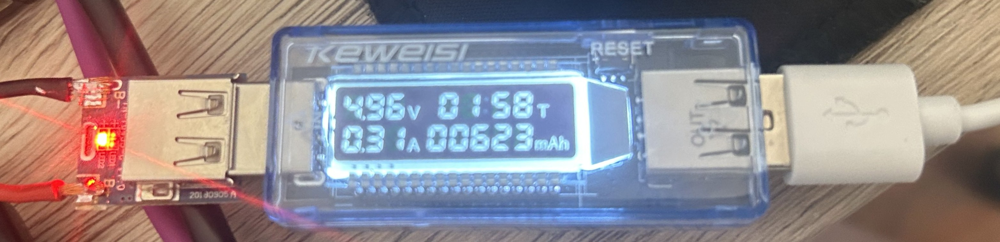
</p>

---

## Mechanical Design and 3D Printing

In addition to electronics and firmware, the project includes custom mechanical parts.

Elements of the enclosure and mechanical assembly were designed specifically for the device and manufactured using **3D printing**.

3D-printed parts are used to:

* hold the PCB and electronics,
* mount sensors and actuators,
* organize the mechanical assembly,
* protect internal components,
* create the final device enclosure and water storage.

### Ultrasonic Sensor and Stepper Motor Mount

<p align="center">
  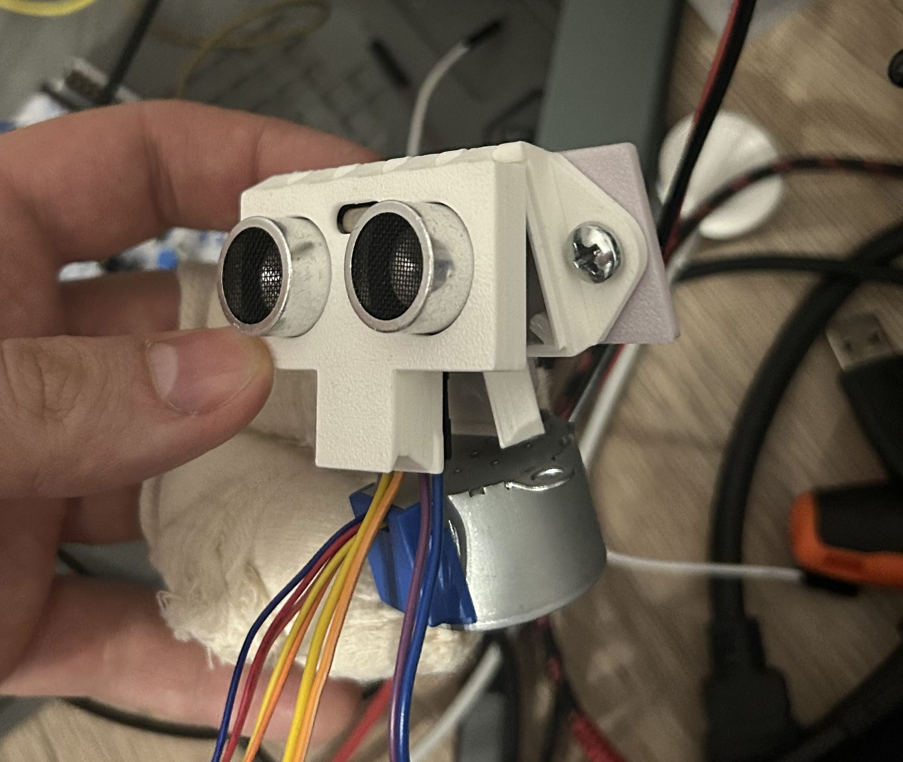
</p>

### Full Prototype 3D Model

<p align="center">
  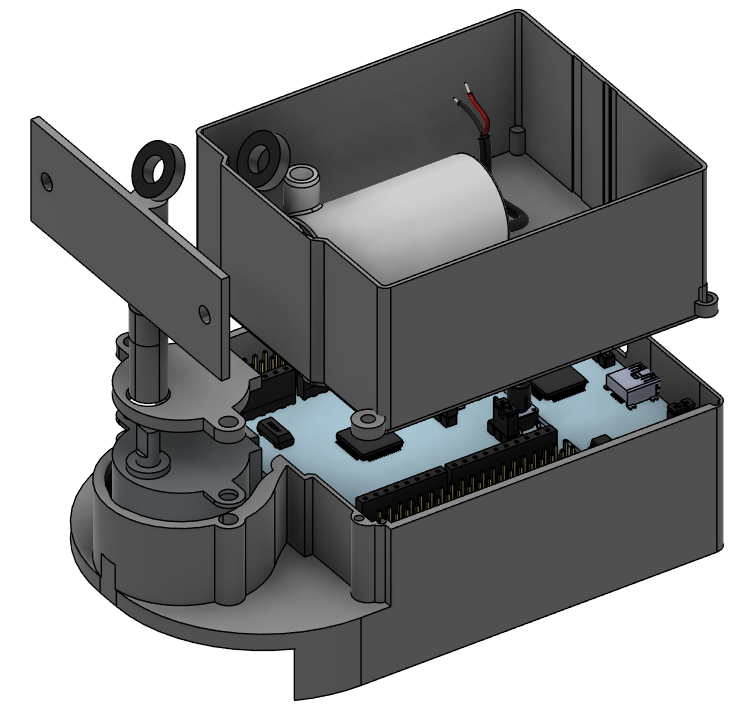
</p>

### First Prototype Case

<p align="center">
  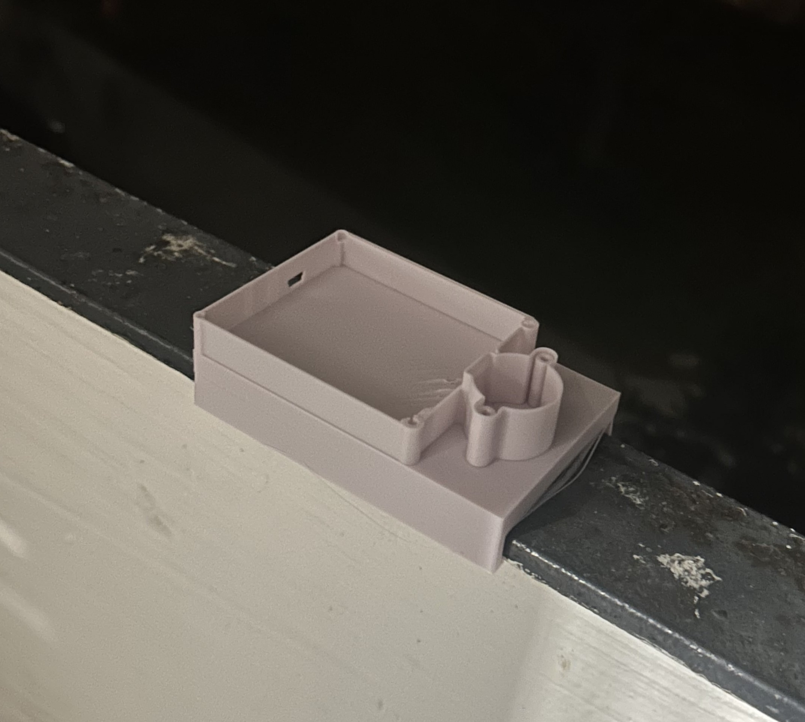
</p>

The mechanical assembly was designed so that the ultrasonic sensor can move together with the stepper-driven scanning mechanism.

---

## Prototype Field Testing

The prototype was also tested outside the development bench to verify the behavior of the complete system in conditions closer to its intended use.

The tests included:

* verification of the device calibration process,
* subsequent object detection,
* activation of the water pump,
* wake-up after entering low-power mode,
* verification of data stored on the SD card.

<p align="center">
  
</p>

<p align="center">
  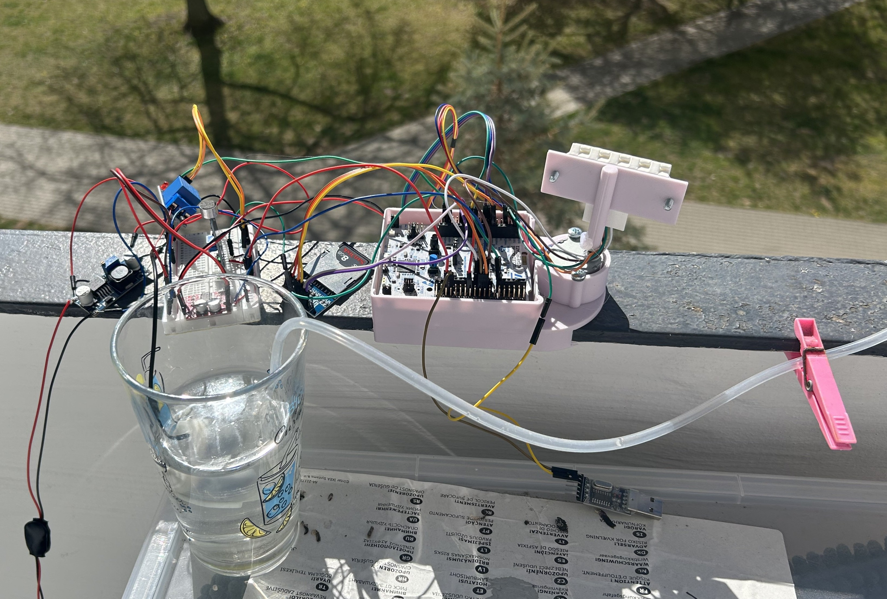
</p>

---

# Migration to Custom Hardware

After the main functionality had been confirmed on the STM32G4 Nucleo, the system was redesigned as a dedicated PCB.

The transition from the development board to the final PCB included:

* replacing ready-made peripheral modules with integrated circuitry,
* selecting a smaller STM32 microcontroller,
* integrating power distribution,
* integrating the microSD interface,
* integrating the sound detection circuit,
* integrating the stepper motor driver interface,
* adding SWD and UART interfaces,
* implementing peripheral power switching,
* adapting firmware to the more resource-constrained MCU.

The final PCB uses the **STM32G030F6P6**.

The STM32G0 provides considerably fewer resources than the STM32G4 used during early development. Because of this, moving the firmware to the final MCU also required attention to:

* Flash and RAM usage,
* peripheral availability,
* firmware size,
* middleware configuration.

<p align="center">
  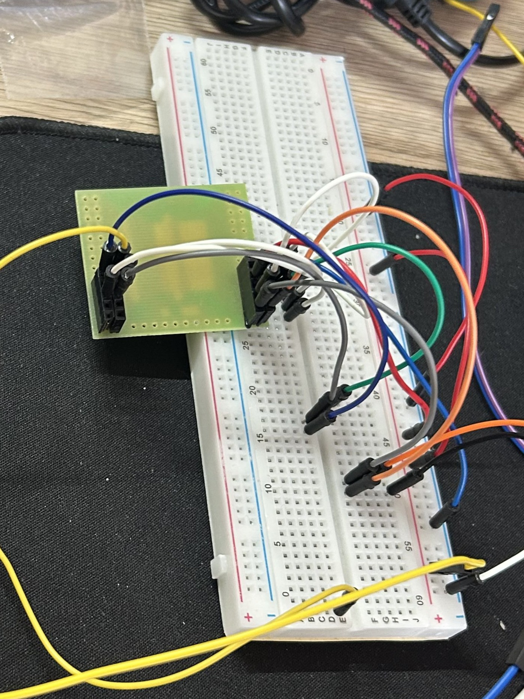
</p>

This migration was an important part of the project because it transformed the initial proof-of-concept into hardware designed specifically for the application.

---

## MCU Comparison

<div align="center">

<table>
  <tr>
    <th align="center">Feature</th>
    <th align="center">STM32G491RET6<br>(NUCLEO-G491RE)</th>
    <th align="center">STM32G030F6P6</th>
  </tr>
  <tr>
    <td align="center">MCU family</td>
    <td align="center">STM32G4</td>
    <td align="center">STM32G0</td>
  </tr>
  <tr>
    <td align="center">CPU core</td>
    <td align="center">Arm Cortex-M4F</td>
    <td align="center">Arm Cortex-M0+</td>
  </tr>
  <tr>
    <td align="center">Maximum CPU frequency</td>
    <td align="center">170 MHz</td>
    <td align="center">64 MHz</td>
  </tr>
  <tr>
    <td align="center">Flash memory</td>
    <td align="center">512 KB</td>
    <td align="center">32 KB</td>
  </tr>
  <tr>
    <td align="center">SRAM</td>
    <td align="center">112 KB total<br>(96 KB SRAM + 16 KB CCM SRAM)</td>
    <td align="center">8 KB</td>
  </tr>
  <tr>
    <td align="center">ADC</td>
    <td align="center">3 × ADC, up to 16-bit with oversampling</td>
    <td align="center">1 × 12-bit ADC, up to 16-bit with oversampling</td>
  </tr>
  <tr>
    <td align="center">SPI interfaces</td>
    <td align="center">Multiple</td>
    <td align="center">2</td>
  </tr>
  <tr>
    <td align="center">I²C interfaces</td>
    <td align="center">Multiple</td>
    <td align="center">2</td>
  </tr>
  <tr>
    <td align="center">USART/UART</td>
    <td align="center">Multiple</td>
    <td align="center">2 USARTs</td>
  </tr>
  <tr>
    <td align="center">RTC</td>
    <td align="center">Yes</td>
    <td align="center">Yes</td>
  </tr>
  <tr>
    <td align="center">Low-power modes</td>
    <td align="center">Sleep, Stop, Standby, Shutdown</td>
    <td align="center">Sleep, Stop, Standby</td>
  </tr>
  <tr>
    <td align="center">Development / debugging</td>
    <td align="center">Integrated ST-LINK on Nucleo board</td>
    <td align="center">External SWD programmer/debugger required</td>
  </tr>
  <tr>
    <td align="center">Package used in the project</td>
    <td align="center">LQFP64 on Nucleo board</td>
    <td align="center">TSSOP20</td>
  </tr>
  <tr>
    <td align="center">Role in the project</td>
    <td align="center">Initial prototype and firmware development</td>
    <td align="center">Final custom PCB</td>
  </tr>
  <tr>
    <td align="center">Main advantage</td>
    <td align="center">High performance, large memory and convenient debugging</td>
    <td align="center">Small size, low cost and sufficient resources for the application</td>
  </tr>
  <tr>
    <td align="center">Main limitation</td>
    <td align="center">Significantly overpowered for the final application</td>
    <td align="center">Limited Flash, RAM and processing performance</td>
  </tr>
</table>

</div>

The migration to the STM32G030F6P6 also pushed the design close to the MCU's available resource limits.

The reduced Flash and SRAM required more careful firmware organization and configuration of middleware such as FatFS.

The limited number of GPIO pins was another important constraint. Nearly all available MCU pins had to be assigned to application functions.

This left very little flexibility for later hardware changes and became one of the important considerations for the next PCB revision.

### STM32CubeMX pinout configuration

<p align="center">
  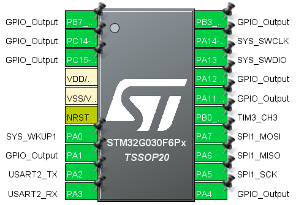
</p>

---

# Custom PCB

The complete circuit was designed as a dedicated PCB integrating the MCU and all required peripheral interfaces.

### PCB 3D View

<p align="center">
  
</p>

### PCB Layout

|                                     PCB                                     |                                         Assembled PCB                                        |
| :-------------------------------------------------------------------------: | :------------------------------------------------------------------------------------------: |
| 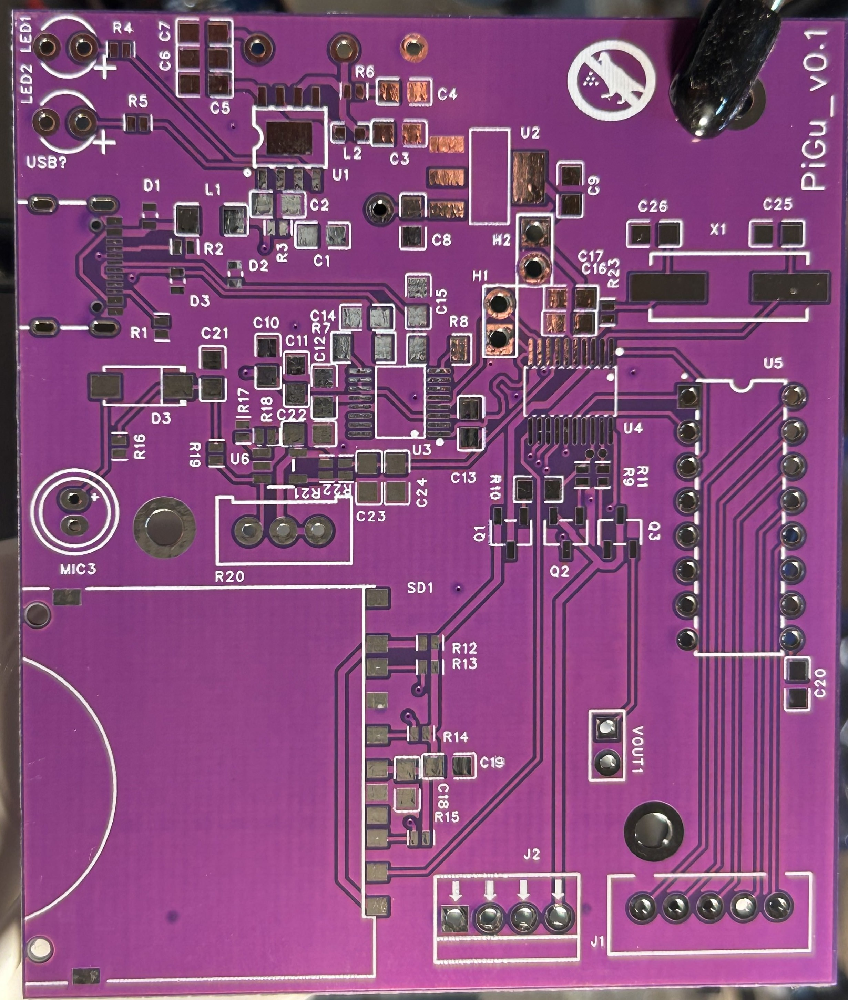 | 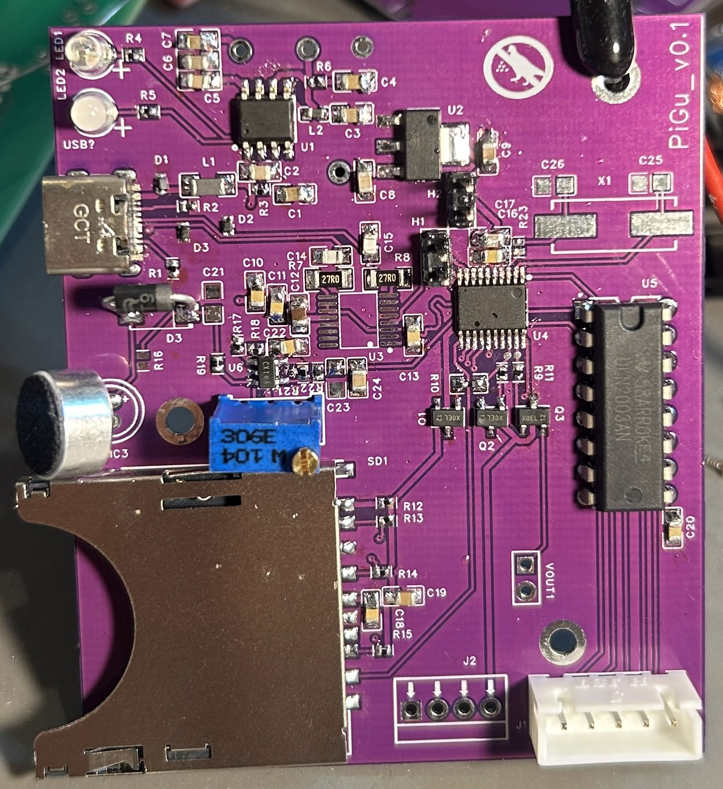 |

Detailed PCB documentation:

* [Electrical schematic](README_Images/schema.pdf)
* [PCB top layer](README_Images/PCB_PCB1_2026-06-20_top.pdf)
* [PCB bottom layer](README_Images/PCB_PCB1_2026-06-20_bot.pdf)

---

# Firmware Architecture

The firmware is written in **C** using the STM32 HAL library.

A simplified application flow is shown below:

<p align="center">
  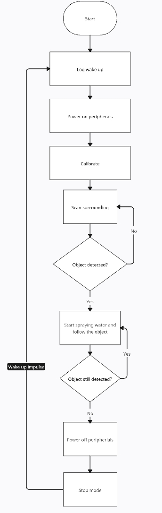
</p>

The firmware follows a cycle in which the system remains in a low-power state until activity is detected.

After wake-up, the system performs calibration and scans the monitored area using the ultrasonic sensor mounted on the stepper-driven mechanism.

If an object is detected, its approximate location is determined. The actuator can then be positioned toward the detected object and the water pump activated.

Important events are logged to the SD card before the system disables unnecessary peripherals and returns to low-power mode.

---

# PCB Bring-Up and Debugging

After assembly, the PCB was tested subsystem by subsystem before attempting complete system operation.

This included:

* power rail verification,
* MCU programming through SWD,
* peripheral interface testing,
* SD communication tests,
* ultrasonic sensor tests,
* actuator tests,
* low-power operation tests.

During debugging, temporary modifications were made directly to the PCB to isolate problems and validate possible fixes.

<p align="center">
  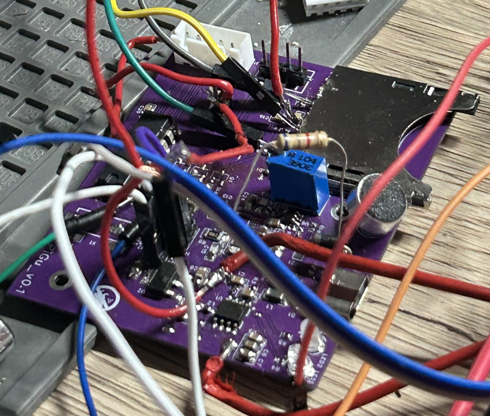
</p>

This stage was particularly important because several issues only became visible after moving from the development-board prototype to the integrated custom PCB.

---

## Battery Power-Management IC

The original PCB uses an **IP5306 battery charging and power-management IC** intended to both charge the Li-Ion battery and supply the system from it.

During testing, this solution proved unsuitable for the application because the IC automatically disables its output when the current consumption falls below its internal minimum-load threshold.

This behavior is particularly problematic because PidgeonGuard intentionally spends part of its operating time in a low-power state.

When the STM32 and external peripherals reduce their current consumption, the power-management IC may interpret the condition as an unused load and disconnect the output completely.

This prevents the system from remaining powered correctly while waiting for a wake-up event.

For the next PCB revision, the battery charging and power-supply architecture should therefore be redesigned using a solution that can maintain a stable output even at very low load currents.

<!-- TODO: Add measured shutdown current threshold -->

---

## UART Programming Through FTDI

An FTDI USB-to-UART interface was included as part of the communication concept but has not yet been fully tested.

In the next revision, the UART interface should also be designed to support **firmware programming through the STM32 system bootloader**, providing an alternative firmware flashing method in addition to SWD.

This requires convenient access to the required UART and boot configuration signals.

---

## SWD Programming Connector

The current PCB exposes the SWD interface through small PCB pads.

Although this solution reduces PCB area, it makes repeated programming and debugging less convenient, especially during board bring-up.

A future PCB revision should use a more convenient programming connection, such as a **pin header**

This would make SWD access significantly easier and reduce the risk of unreliable temporary connections during debugging.

---

## SWD Pin Reuse

One of the most important issues found during debugging was the reuse of pins associated with the SWD programming interface for controlling MOSFET switching stages used for peripheral power and pump control.

Reconfiguring these pins as regular GPIO outputs can interfere with SWD communication and may make the MCU difficult to reconnect to and reprogram.

For the next PCB revision, the SWD pins should remain dedicated to programming and debugging.

The MOSFET control signals should instead be moved to GPIO pins that do not interfere with SWD.

Since the final design uses the STM32 internal oscillator and does not require an external crystal, GPIO pins associated with unused external clock functionality are potential candidates.

This would significantly improve development reliability and prevent firmware configuration from accidentally blocking normal SWD access.

<!-- TODO: Verify the final alternative GPIO assignment in STM32CubeMX -->

---

## Stepper Motor Routing

The routing between the STM32 and the stepper motor driver should also be improved in the next PCB revision.

The current routing works as a prototype implementation, but the control traces can be reorganized to create a cleaner and more direct connection between the MCU and the motor driver.

---

## SD Interface Debugging

One of the more significant hardware/firmware debugging tasks during development involved the microSD interface.

Because SD logging had already been successfully implemented on the original STM32G4 Nucleo prototype, the same development board was later used as a diagnostic reference while debugging the STM32G0 custom PCB.

The STM32G4 Nucleo was connected directly to the SD signals of the custom PCB and was able to access the card correctly when the STM32G0 was inactive.

This test confirmed that:

* the SD socket connections were correct,
* the PCB traces were functional,
* the card itself was operational,
* a known working STM32 implementation could communicate through the physical interface of the custom board.

The test helped isolate the remaining problem to the STM32G0 firmware/configuration rather than the physical SD interface.

The final root of not properly saving logs was connected with FatFS configuration it self and attempts to minimize firmware RAM and FLASH usage.

---

# Project Development

The project was developed iteratively, starting from a modular prototype and gradually moving toward a fully custom embedded system.

The development process included:

1. testing individual sensors and actuators,
2. creating the first complete prototype using an STM32G4 Nucleo and ready-made modules,
3. developing and validating the initial firmware,
4. verifying SD logging, motor control, sensing and wake-up functionality,
5. selecting a smaller STM32G0 MCU appropriate for the final requirements,
6. designing the custom schematic,
7. designing and manufacturing the PCB,
8. assembling the board,
9. porting the firmware from STM32G4 to STM32G0,
10. replacing development modules with integrated circuitry,
11. testing individual hardware blocks on the custom PCB,
12. debugging hardware and firmware interactions,
13. implementing low-power operation,
14. designing and 3D-printing enclosure and mechanical components,

---

# Improvements for PCB Revision 2

Testing of the first custom PCB revealed several design changes that should be implemented in the next hardware revision.

The most important planned improvements are:

* **Redesign the battery power-management circuit** so that the system remains powered even when the current consumption falls to the very low levels reached in standby mode.
* **Add and test UART bootloader programming through an FTDI adapter** as an alternative firmware flashing method.
* **Improve SWD accessibility** by replacing simple exposed pads with a dedicated connector or a more convenient programming footprint.
* **Keep SWD pins dedicated to programming and debugging** instead of reusing them for peripheral-power or pump MOSFET control.
* **Move MOSFET control signals to other GPIO pins**, potentially using unused external oscillator pins if the internal oscillator remains sufficient.
* **Redesigning n-MOSFET transistors to p-MOSFET** for better power supply switching.
* **Improve stepper motor control routing** by creating shorter and cleaner connections between the MCU and the motor driver.
* **Improve mechanical and environmental protection**, including better water resistance of the enclosure.
* **Complete and verify the UART/FTDI interface** on physical hardware.
* **Continue improving the calibration algorithm** to reduce false detections caused by people or other large objects.
* **Apply the hardware fixes identified during PCB bring-up** to PCB revision 2.

### PCB fragments to change for rev.2

<p align="center">
  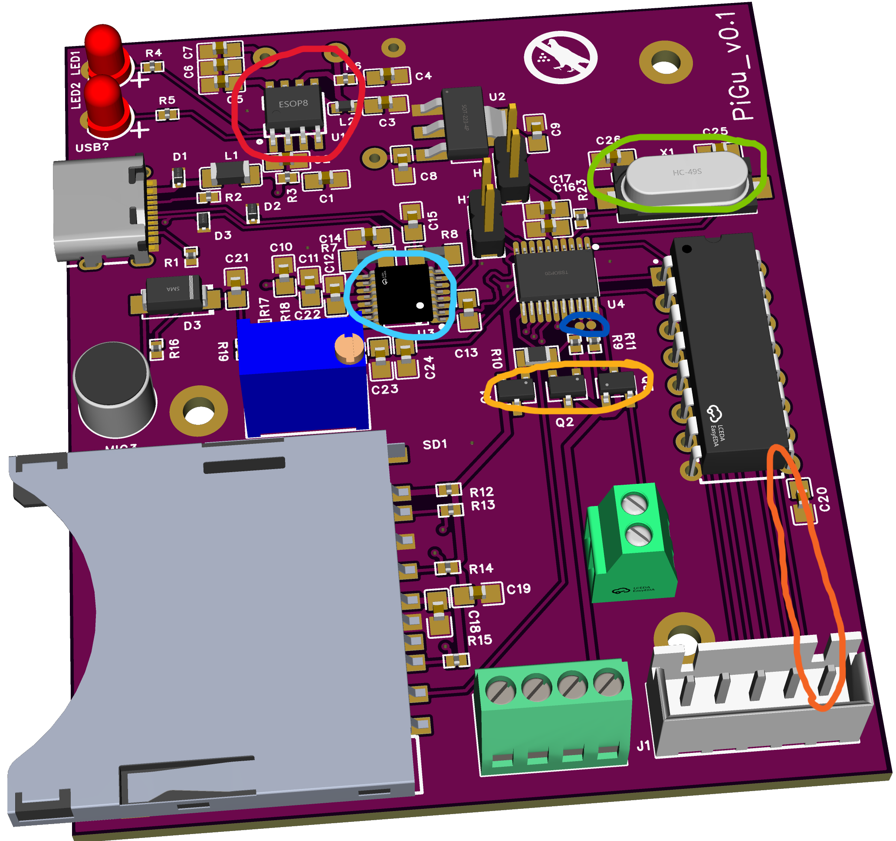
</p>

<!-- TODO: Replace this list with completed changes after PCB revision 2 is manufactured -->
